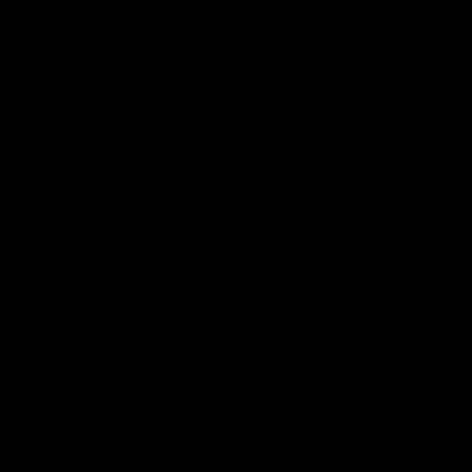
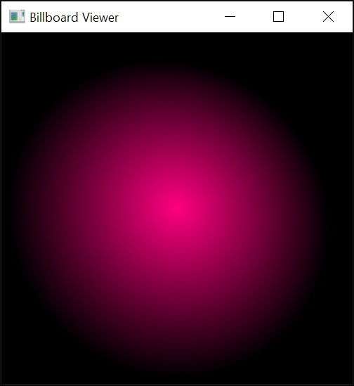

# particles

Implements particle systems using openGL

## My Particle Effect: Explosion Effect
I have created an explosion effect using two types of textures: fire burst and smoke. It works by first increasing the size of a fire burst until it reaches a certain level and then switching the texture and its color to smoke and decreasing size and opacity of the particles.


## Basic Billboard and Confetti



## How to build

*Windows*

Open git bash to the directory containing this repository.

```
particles $ mkdir build
particles $ cd build
particles/build $ cmake -G "Visual Studio 16 2019" ..
particles/build $ start CS312-Particles.sln
```

Your solution file should contain two projects: `pixmap_art` and `pixmap_test`.
To run from the git bash command shell, 

```
particles/build $ ../bin/Debug/billboard
particles/build $ ../bin/Debug/confetti
particles/build $ ../bin/Debug/demo
```

*macOS*

Open terminal to the directory containing this repository.

```
particles $ mkdir build
particles $ cd build
particles/build $ cmake ..
particles/build $ make
```

To run each program from build, you would type

```
particles/build $ ../bin/billboard
particles/build $ ../bin/confetti
particles/build $ ../bin/demo
```

